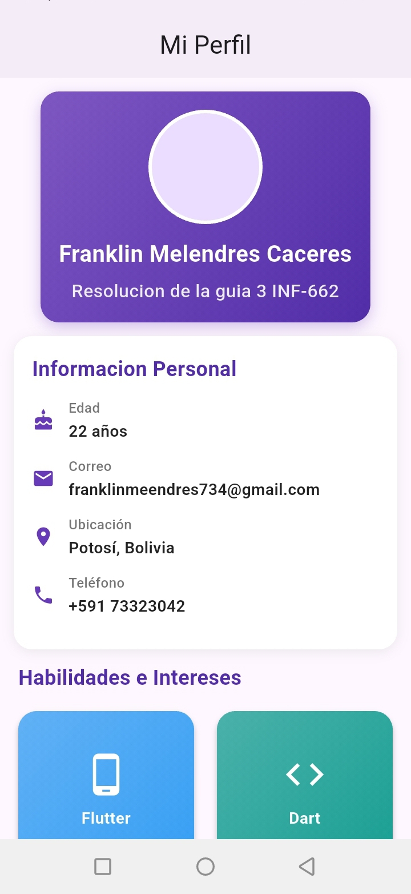
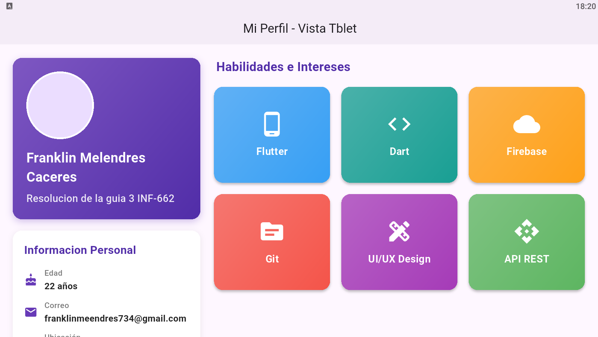

# Realizacion de la guia 3 Desarrollo de aplicaciones moviles INF 662

> _El siguiente trabajo muestra el desarrollo del inciso 8. Trabajo Independiente_

## Descripción

Esta aplicación presenta un perfil personal en esta caso propio ejemplificado que cambia su estructura y distribución de elementos según el tamaño de pantalla del dispositivo, ofreciendo una experiencia óptima tanto en teléfonos como en tablets.

## Características

- Diseño adaptable automático (teléfono/tablet)
- Sección de perfil con foto, nombre y profesión
- Información personal organizada
- Tarjetas de habilidades con diseño de grilla adaptable
- Tipografía y espaciados responsivos

## Fases Clave del Código

### 1. **Detección del Tipo de Dispositivo**

```dart
final double width = MediaQuery.of(context).size.width;
final bool isTablet = width >= 600;
```

**¿Para que sirve?:** Obtiene el ancho de pantalla y define si es tablet usando un breakpoint de 600 píxeles.

---

### 2. **Selección de Layout Responsivo**

```dart
LayoutBuilder(
  builder: (context, constraints) {
    return isTablet
        ? _buildTabletLayout(context)
        : _buildPhoneLayout(context);
  },
)
```

**¿Para que sirve?:** Evalúa el espacio disponible y carga el diseño apropiado según el dispositivo.

---

### 3. **Estructura para Teléfono (Vertical)**

```dart
Widget _buildPhoneLayout(BuildContext context) {
  return Column(
    children: [
      _EncabezadoSection(isTablet: false),
      _InformacionPersonalSection(isTablet: false),
      _HabilidadesSection(isTablet: false),
    ],
  );
}
```

**¿Para que sirve?:** Organiza los elementos en columna vertical para pantallas pequeñas.

---

### 4. **Estructura para Tablet (Horizontal)**

```dart
Widget _buildTabletLayout(BuildContext context) {
  return Row(
    children: [
      Expanded(
        flex: 1,
        child: Column([
          _EncabezadoSection(isTablet: true),
          _InformacionPersonalSection(isTablet: true),
        ]),
      ),
      Expanded(
        flex: 2,
        child: _HabilidadesSection(isTablet: true),
      ),
    ],
  );
}
```

**¿Para que sirve?:** Distribuye el contenido horizontalmente, con el perfil ocupando 1/3 y las habilidades 2/3 del espacio.

---

### 5. **Grilla Adaptable de Habilidades**

```dart
GridView.builder(
  gridDelegate: SliverGridDelegateWithFixedCrossAxisCount(
    crossAxisCount: isTablet ? 3 : 2,
    crossAxisSpacing: 12,
    mainAxisSpacing: 12,
    childAspectRatio: isTablet ? 1.2 : 1.1,
  ),
  itemCount: habilidades.length,
  itemBuilder: (context, index) {
    // Construcción de tarjetas
  },
)
```

**¿Para que sirve?:** Ajusta dinámicamente el número de columnas (2 o 3) según el tipo de dispositivo.

---

### 6. **Tipografía Responsiva**

```dart
Text(
  'Franklin Melendres',
  style: TextStyle(
    fontSize: isTablet ? 24 : 20,
    fontWeight: FontWeight.bold,
  ),
)
```

**¿Para que sirve?:** Adapta el tamaño de fuente según el dispositivo para mejorar la legibilidad.

---

### 7. **Espaciados Dinámicos**

```dart
padding: EdgeInsets.all(isTablet ? 24 : 12)
```

**¿Para que sirve?:** Ajusta márgenes y padding para aprovechar mejor el espacio en tablets.

## Tecnologías y Widgets Utilizados

| Componente | Descripción |
|------------|-------------|
| `MediaQuery` | Detecta dimensiones de la pantalla |
| `LayoutBuilder` | Construye UI adaptable según restricciones |
| `GridView.builder` | Crea grilla dinámica de tarjetas |
| `Column` / `Row` | Organiza elementos vertical/horizontalmente |
| `Expanded` | Distribuye espacio proporcionalmente |
| `Card` | Tarjetas con elevación y sombras |
| `CircleAvatar` | Foto de perfil circular |
| `Container` | Decoración con gradientes y bordes |

## Estructura del Proyecto

```
lib/
└── main.dart                      # Archivo principal
    ├── MiPerfilResponsivo        # Widget raíz de la app
    ├── PerfilHome                 # Pantalla principal
    ├── _EncabezadoSection         # Sección de perfil
    ├── _InformacionPersonalSection # Datos personales
    └── _HabilidadesSection        # Grilla de habilidades
```

## Cómo Ejecutar

### En vscode

1. Crear un nuevo proyecto en flutter
2. Direccionarse al directorio `lib/main.dart`
3. Reemplazar el codigo del unico archivo a su `main.dart`
4. Iniciar un emulador y ctrl + f5 para correr el programa
5. Selecciona un dispositivo (teléfono o tablet)

### En FlutLab

1. Accede a <https://flutlab.io>
2. Crea un nuevo proyecto Flutter
3. Reemplaza el contenido de `lib/main.dart` con el código
4. Presiona **Run** (▶️)
5. Selecciona un dispositivo (teléfono o tablet)

### En Local(si encaso no es posible las anteriores)

```bash
# Clonar el proyecto

git clone [url-del-repositorio]

# Navegar al directorio
cd mi_perfil_responsivo

# Instalar dependencias
flutter pub get

# Ejecutar la aplicación
flutter run
```

### En neovim

_coming soon....._

## Capturas de Pantalla

### Vista Teléfono



### Vista Tablet



## Datos del Perfil

- **Nombre:** Franklin Melendres Caceres
- **Razon:** Resolucion de la guia 3 INF-662
- **Edad:** 22 años
- **Correo:** <franklinmeendres734@gmail.com>
- **Ubicación:** Potosí, Bolivia
- **Teléfono:** +591 73323042

## Habilidades Destacadas

1. **Flutter** - Desarrollo multiplataforma
2. **Dart** - Lenguaje de programación
3. **Firebase** - Backend y servicios en la nube
4. **Git** - Control de versiones
5. **UI/UX Design** - Diseño de interfaces
6. **API REST** - Integración de servicios

## 🔧 Principios de Diseño Aplicados

| Principio | Implementación |
|-----------|----------------|
| **Claridad visual** | Mismos elementos reorganizados según dispositivo |
| **Consistencia** | Colores y tipografía coherentes en todas las vistas |
| **Adaptabilidad** | UI reacciona dinámicamente al espacio disponible |
| **Usabilidad** | Información accesible y legible en cualquier pantalla |

## Conceptos de Flutter Utilizados

### Breakpoints Responsivos

```dart
final bool isTablet = width >= 600;
```

Define un punto de quiebre para cambiar el diseño.

### Widgets Condicionales

```dart
isTablet ? VistaTablet() : VistaMovil()
```

Renderiza diferentes widgets según la condición.

### Proporciones Flexibles

```dart
Expanded(flex: 2, child: Widget())
```

Distribuye espacio proporcionalmente entre widgets.

### Grillas Dinámicas

```dart
crossAxisCount: isTablet ? 3 : 2
```

Cambia el número de columnas automáticamente.

## Aprendizajes Clave

- Implementación de diseño responsivo en Flutter
- Uso de MediaQuery para detección de dispositivos
- Aplicación de LayoutBuilder para layouts adaptativos
- Construcción de grillas flexibles con GridView
- Manejo de tipografía y espaciados responsivos
- Organización de código con widgets modulares

## Requisitos Técnicos Cumplidos

- [x] Uso de `MediaQuery` para ancho de pantalla
- [x] Breakpoint de 600 píxeles definido
- [x] `LayoutBuilder` para cambio de estructura
- [x] `GridView.builder` para tarjetas
- [x] Diseño vertical para teléfono
- [x] Diseño horizontal para tablet
- [x] Tipografía adaptable (14-18px / 18-24px)
- [x] Espaciados adaptables (12px / 24px)
- [x] 2 columnas en teléfono / 3 en tablet

## Contribuciones

Este proyecto fue desarrollado como parte del **Laboratorio 3** de la materia **Desarrollo de Aplicaciones Móviles (INF662)** - Universidad Autónoma Tomás Frías.

## Licencia

Este proyecto es de uso educativo y fue creado con fines académicos
---

**Desarrollado con ❤️ usando Flutter**
